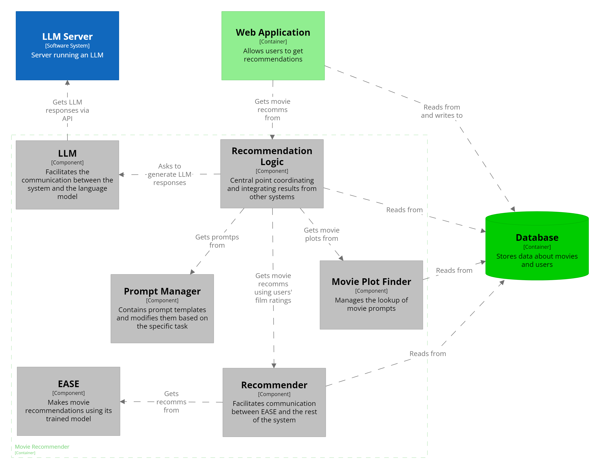

# Conversational Recommender System
- This project allows the user to get movie recommendations using a textual interface. The system utilizes LLMs to handle the user input and to enhance the movie recommendation.

## Installation

### Prerequisites
- Python 3.10
- Pip
- Virtualenv (optional but recommended)

### How to Install
- Upgrade pip with `python -m pip install --upgrade pip`
- Install required dependencies with `pip install -r requirements.txt`

### Configuration
- Update the `/datasets/config.json` and `/system/scripts/config.json` files and fill the required fields - the process is detailed in the technical documentation below.

### Running the Application
- Inside the `system/scripts/` directory, run `python app.py`
- Open your browser and navigate to `http://localhost:5000/`  

## User documentation
### User Profile
- Users can create their profiles by registering. They can then add which movies they liked by clicking on the movies they get recommended.

### Parameters 
- RS/LLM or RS/Tag Importance (Both systems)
  - Sets how much weigh should the system put into the scores assigned by traditional recommender system versus the scores assigned by LLM (LLM Based) or how closely tags match (Tag Based).
- Use my past ratings (Both systems)
  - If user is logged in, they can have the ratings from their user profiles used in the recommendation as additional information.
- K-movies (Both systems)
  - How many movies user wants to get recommended.
- Model (LLM based)
  - Chooses which language model to use during recommendation. We recommend GPT (GPT-3.5-turbo) for best balance of speed and accuracy.

### LLM Based Recommendation
- Users can get recommendations by entering textual description of their preferences in the Home page.
- For best results, structure the prompt in the form "I like/love/hate... movie1, movie2 and I want to see 'something general' (e.g., gritty fantasy, light-hearted comedy)".

### Tag Based Recommendation
- By clicking the "Lite" webpage, users can set which movies they liked or disliked and which tags they'd like to.
- The system rates how closely the chosen tags match each movie and assign scores based on that
- This version doesn't use LLMs in any way.

## Technical Documentation

### Dataset Transformation and Model Training
- Relevant files and scripts are inside the `/datasets/` directory

#### Tag Genome
- `1_transform_taggenome.ipynb` 
- We used [Google Colab](https://colab.research.google.com/) to transorm the [Tag Genome](https://grouplens.org/datasets/movielens/tag-genome-2021/) dataset. We removed inactive users, their ratings, and unpopular movies

#### Movie Plots
- `2_combine_with_plots.ipynb`
- Should be run after transforming Tag Genome
- Uses `original-data/wiki_movie_plots_deduped.csv` from [Kaggle](https://www.kaggle.com/datasets/jrobischon/wikipedia-movie-plots) to link the movies plots with movies from Tag Genome

#### EASE Training
- `train_ease.ipynb`
- Ran in Colab on CPU with high RAM. 
- Trains the EASE model on Tag Genome and chooses the best lambda

#### Poster Downloading
- `download_posters_tmdb.py`
- Uses [TMDb's](https://www.themoviedb.org/) API to download movie posters.
- Requires a `config.json` file with the key `TMDB_API_KEY`. You can get your key by following this [guide](https://developer.themoviedb.org/docs/getting-started) 

#### Additional Info
- The resulting data should be moved to `/system/data/` so that it can be used in the application.
  - The directory should contain `links.csv`, `movie_plots.csv`, `movies.json`, `tag_count.json`, and `tags.json`.
- The movie posters should be moved to `/system/scripts/static/posters`.
  - However, this is not necessary, as the system is able to download these posters during runtime.

### System Design

*The schema of our system. Our classes are in gray*
- Relevant files are inside the `/system/scripts/` directory
- The application uses the Flask framework and the code is located inside `app.py`. You can change the endpoints here.
- The html files used in our application are inside `templates/` and the css files with movie posters `static/`.
- `app.py` gets the recommendation from `recommendation_logic.py`, which coordinates the other components to create recommendations. If you want to change or extend this application, `recommendation_logic.py` would be the best place to start.
  - `RecommendationLogic` is separated into two parts, one which handles LLM based recommendation, while the second one handles Tag based recommendation. The Tag Based recommendation is much more straightforward, so we will focus on the LLM based recommendation going forward.
  - `RecommendationLogic` uses:
    - The `LLM` class to handle interactions with the LLM server and to help with splitting the LLM answers into proper formats.
    - The `PromptManager` class to get expected prompt formats that are then passed into `LLM`.
    - The `Recommender` class to serve as an interface between it and the `EASE` class, which handles recommendation using collaborative filtering. `Recommender` wraps around `EASE` and converts its outputs into expected formats.
- If you want to change how to communicate with the LLM server or want to and another LLM, you can do it in the `LLM` class. The system currently supports [Mistral](https://huggingface.co/mistralai/Mistral-7B-Instruct-v0.2), [Mixtral](https://huggingface.co/mistralai/Mixtral-8x7B-v0.1), [GPT-3.5](https://platform.openai.com/docs/models/gpt-3-5-turbo), and [GPT-4o](https://platform.openai.com/docs/models/gpt-4o).
- This directory also requires a `config.json` file, containing `TMDB_API_KEY` and api urls and keys to communicate with the LLMs. 
  - If you want to use GPT models, sign up to [OpenAI](https://platform.openai.com/), create your api key, and put it into the `openai_api_key` in `config.json`.
  - If you want to use Hugging Face models (Mistral or Mixtral), get your key (token) by following these [instructions](https://huggingface.co/docs/hub/en/security-tokens). Put the token into `huggingface_api_key`.
    - For light use, our system uses Hugging Face's Inference API to generate LLM responses for free - note that lately Mixtral stopped working this way, so it's likely that only Mistral can be used like this.
    - If you need to use our application more heavily, create a dedicated Inference Endpoint on Hugging Face instead.
 
### Database

*The schema of our database. PK stands for Primary Key, and FK for Foreign Key*

- We are using SQLAlchemy to store our data
- The tables are described in `/system/scripts/models.py`. This file also includes functions that populate the database with Movies, Tags, and TagCounts we got from Tag Genome.